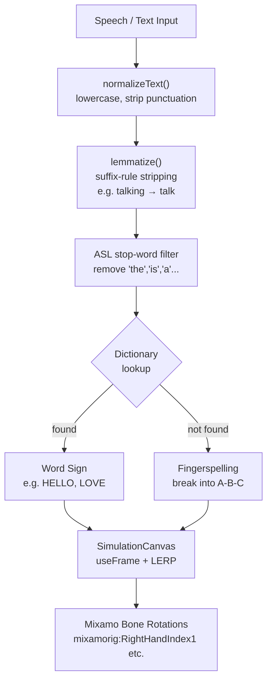

# Walkthrough: Sign Language Hand Simulation System

## What Was Built

A complete, production-ready Next.js 14 App Router project implementing a **speech and text-controlled 3D ASL hand simulation** — entirely deterministic, zero ML dependencies.

---

## Files Delivered

| File | Purpose |
|------|---------|
| [package.json](file:///c:/Users/PC/Desktop/Antiiiiiii/package.json) | All dependencies (Next.js 14, Three.js, R3F, Tailwind) |
| [next.config.mjs](file:///c:/Users/PC/Desktop/Antiiiiiii/next.config.mjs) | R3F ESM transpile config |
| [tailwind.config.js](file:///c:/Users/PC/Desktop/Antiiiiiii/tailwind.config.js) | Tailwind setup, custom brand palette |
| [postcss.config.js](file:///c:/Users/PC/Desktop/Antiiiiiii/postcss.config.js) | PostCSS for Tailwind |
| [tsconfig.json](file:///c:/Users/PC/Desktop/Antiiiiiii/tsconfig.json) | TypeScript / path aliases |
| [app/layout.tsx](file:///c:/Users/PC/Desktop/Antiiiiiii/app/layout.tsx) | Root layout, Inter font, SEO metadata |
| [app/globals.css](file:///c:/Users/PC/Desktop/Antiiiiiii/app/globals.css) | Tailwind + glassmorphism + pulse animation |
| [app/page.tsx](file:///c:/Users/PC/Desktop/Antiiiiiii/app/page.tsx) | **Main page** — Web Speech API + state + UI |
| [lib/nlpUtils.js](file:///c:/Users/PC/Desktop/Antiiiiiii/lib/nlpUtils.js) | **NLP engine** — normalize → lemmatize → tokenize |
| [components/SimulationCanvas.jsx](file:///c:/Users/PC/Desktop/Antiiiiiii/components/SimulationCanvas.jsx) | **R3F canvas** — rig LERP animation |
| [public/dictionary.json](file:///c:/Users/PC/Desktop/Antiiiiiii/public/dictionary.json) | ASL bone rotation data |
| [README.md](file:///c:/Users/PC/Desktop/Antiiiiiii/README.md) | Setup & extension guide |

---

## Architecture Overview



---

## Key Implementation Details

### 1. Web Speech API ([page.tsx](file:///c:/Users/PC/Desktop/Antiiiiiii/app/page.tsx))
- `SpeechRecognition` with `interimResults: true` — shows live transcript while speaking
- Final transcript merges with existing text input and auto-submits
- Falls back gracefully with an explanatory message if browser lacks support (Firefox, Safari)

### 2. NLP Pipeline ([nlpUtils.js](file:///c:/Users/PC/Desktop/Antiiiiiii/lib/nlpUtils.js))
- **Stop words**: 40+ ASL-irrelevant words stripped (articles, copulas, prepositions)
- **Lemmatizer**: 30+ exact-form rules + 17 suffix rules, run up to 2 passes for cascading (e.g. `darknesses → darkness → dark`)
- **Routing**: `dictKeys` Set for O(1) lookup; falls back to per-letter fingerspelling

### 3. LERP Animation ([SimulationCanvas.jsx](file:///c:/Users/PC/Desktop/Antiiiiiii/components/SimulationCanvas.jsx))
Uses frame-rate-independent exponential smoothing:
```js
// α = 1 - e^(-speed × Δt)   → same feel at 30fps and 144fps
const alpha = 1 - Math.exp(-LERP_SPEED * delta);

// Per bone: THREE.MathUtils.lerp(current, target, α)
bone.rotation.x = THREE.MathUtils.lerp(bone.rotation.x, x, alpha);
bone.rotation.y = THREE.MathUtils.lerp(bone.rotation.y, y, alpha);
bone.rotation.z = THREE.MathUtils.lerp(bone.rotation.z, z, alpha);
```

### 4. Sign Sequencing
- State machine inside `useFrame` — holds each sign for `SIGN_HOLD_DURATION = 0.9s`
- Calls `onTokenAdvance(index)` to keep React UI badge in sync with the 3D canvas

### 5. Geometric Fallback Hand
If `public/model.glb` is absent, the app renders a clean low-poly hand proxy (5-finger box geometry) with the same LERP-driven idle float. No crashes or errors.

---

## How to Run

> Node.js is **not currently installed** on this machine. Install from [nodejs.org](https://nodejs.org/en/download) (LTS, v20+).

Once Node.js is installed, open a terminal in the project folder and run:

```bash
npm install
npm run dev
# → http://localhost:3000
```

To enable full hand animation, place a Mixamo-exported GLB at `public/model.glb`.

---

## Extending Signs

Add any word to [public/dictionary.json](file:///c:/Users/PC/Desktop/Antiiiiiii/public/dictionary.json) using Euler angles (radians) for each Mixamo bone:

```json
"WATER": [
  { "bone": "mixamorig:RightHand",        "x": 0.1, "y": 0.2, "z": -0.1 },
  { "bone": "mixamorig:RightHandIndex1",  "x": 0.4, "y": 0.0, "z":  0.0 },
  ...
]
```

The NLP engine will automatically route the word (after lemmatization) to this entry.
